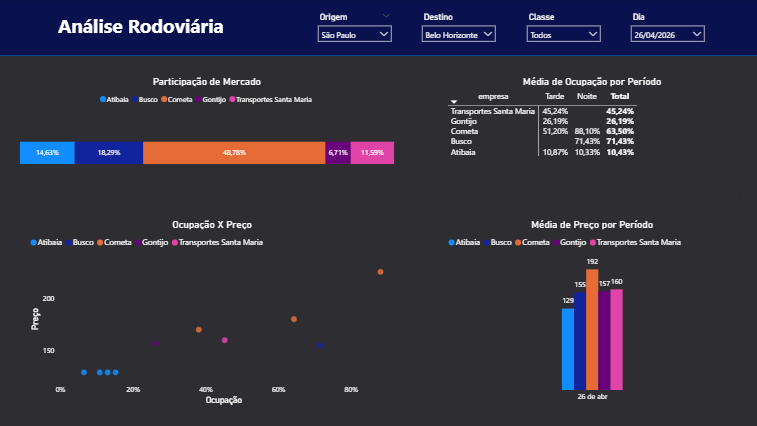
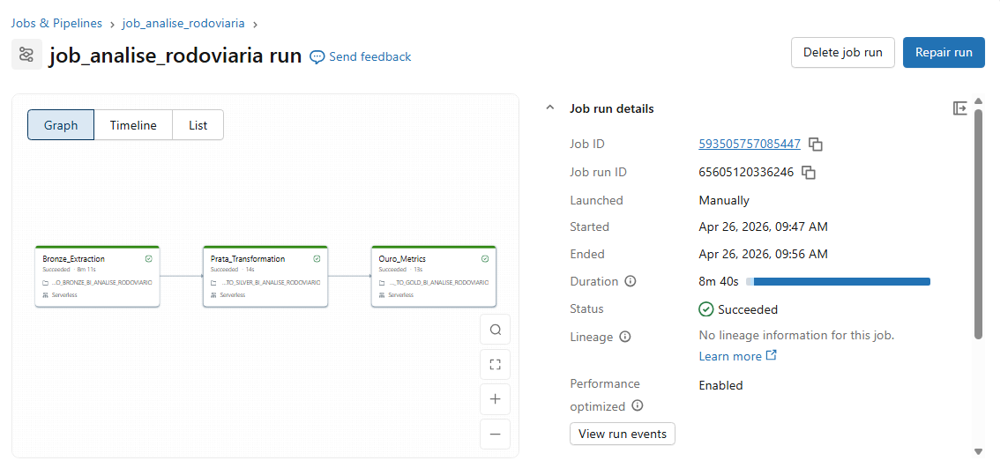

# Projeto de Análise Rodoviária
Este projeto tem como objetivo a construção de um pipeline completo de dados para monitoramento do mercado rodoviário brasileiro, desde o web scraping de passagens até a visualização em um dashboard estratégico de inteligência competitiva.

  

O fluxo contempla a extração (scraping), transformação, armazenamento (Arquitetura Medalhão) e consumo dos dados, com atualização automática diária via Databricks Jobs.

## Descrição do Projeto
Os dados são coletados via web scraping das rotas que conectam as cidades de Vitória (ES), Rio de Janeiro (RJ), São Paulo (SP) e Belo Horizonte (MG), capturando informações detalhadas de cada viagem disponível.

O processamento é realizado no Databricks utilizando a Arquitetura Medalhão:

Camada Bronze: Extração bruta via Python (Requests/BS4) salvando o estado JSON das páginas.

Camada Prata: Tratamento de dados em SQL, realizando o parsing de datas (ISO8601), padronização de nomes de empresas, rodoviárias de origem/destino e cálculo de janelas de antecedência.

Camada Ouro: Modelagem de negócios com criação de métricas como capacidade estimada por classe de serviço, taxa de ocupação e categorização de turnos (Madrugada, Manhã, Tarde, Noite).

Os dados são armazenados e versionados em tabelas no formato Delta Lake.

Foi implementado um Job de atualização diária, responsável por orquestrar todo o pipeline, desde a raspagem dos novos dados até a atualização das tabelas de consumo.

  

O painel foi desenvolvido no Power BI, constando em uma visão consolidada:

Participação de Mercado: Gráfico de barras horizontais exibindo o Market Share por empresa.

Média de Ocupação por Período: Matriz detalhando a taxa de ocupação por empresa e período selecionado.

Ocupação X Preço: Gráfico de dispersão analisando a correlação entre a lotação dos ônibus e a estratégia de precificação.

Média de Preço por Período: Gráfico de colunas comparando os valores médios praticados por cada operadora no período selecionado.

## Ética de Dados e Responsabilidade Técnica
Este projeto foi desenvolvido estritamente para fins de estudo e demonstração de arquitetura, com foco em boas práticas de engenharia e ética de dados. Por esse motivo, limitei propositalmente o volume de rotas, as janelas de datas e a frequência de atualização do Job para garantir que o pipeline seja leve e respeite os limites dos servidores de origem. Também apliquei técnicas de ofuscação de domínios sensíveis, visando proteger a fonte de dados, garantindo que o script não seja utilizado para fins indevidos.

